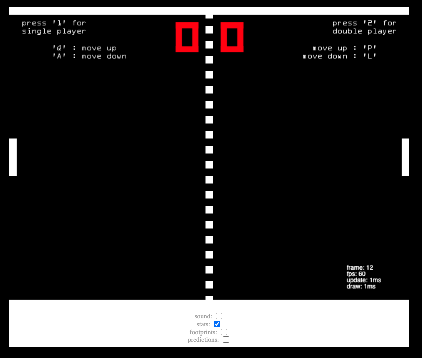

# Pong Game

## Description

Pong is a two-dimensional sports game that simulates table tennis. The player controls an in-game paddle by moving it vertically across the left or right side of the screen. They can compete against another player controlling a second paddle on the opposing side. Players use the paddles to hit a ball back and forth. The goal is for each player to reach nine points before the opponent; points are earned when one fails to return the ball to the other.<br>
<br>

<br><br>

The Application can be accessed using the below link: <br>
[https://johnyxu.github.io/Pong/](https://johnyxu.github.io/Pong/)

## Table of Contents

- [Pong Game](#pong-game)
  - [Description](#description)
  - [Table of Contents](#table-of-contents)
  - [Technical Features](#technical-features)
    - [Pre-Requisites](#pre-requisites)
    - [The Core implementation](#the-core-implementation)
  - [Usage GuideLines](#usage-guidelines)
    - [How to play with it](#how-to-play-with-it)
## Technical Features

### Pre-Requisites
To implement this game, we need some basic knowledge about web development and game runner loop,  there are a few pre-requisites we are going to need:
- Canvas
- addEventListener
- DOMContentLoaded
- Image Loader
- Collision Detection
- Game Loop

### The Core implementation

The difficult part is to split the logic of this game, I will explain the core part of the class.

- Game.js
It provides a basic series of method to connect with DOM event, it provides addEvent & removeEvent to bind the function implementation with the specific element, and also we can create Audio && Canvas that the game needed by createAudio and createCanvas.
We can use loadImages load image resources and a callback with these resources, after we finish loading all the images.

- Runner.js
It's a wrapper of the main game loop, and it provides draw & update method in each frame. Since we passed the true game class to this Runner, we can call some methods that Pong owns by the game, and call specific implementation methods by game delegate. The game loop run in the SetInterval callback method, we also draw the canvas in the game loop, in the meantime, we will update the game logic as time go.
There are two Canvas, one is the front Canvas and the other is the background Canvas. When we render, we display the front canvas to the web page, and at the same time the content to be displayed in the next frame will be drawn on the background canvas, and then we draw the content from background canvas to the front canvas, which can avoid flickering during the game drawing and keep the game smoother

- How to check the Collision Detection between ball and paddle
The ball moves from p1 to p2 during the time interval (dt) and the paddle edge stretches from p3 to p4 and we need to see if these line segments intersect.
We want to be able to see if the ball intercepts the obvious side of the bat.
If the ball is moving left, check the right edge of player 1’s bat.
If the ball is moving right, check the left edge of player 2’s bat.

- Some of the Canvas API
```JavaScript
// fillStyle: specifies the color, gradient, or pattern to use inside shapes. The default style is #000 (black)
context.fillStyle = "white";

// draws a rectangle that is filled according to the current fillStyle
context.fillRect(x, y, width, height);

// specifies the color, gradient, or pattern to use for the strokes (outlines) around shapes. The default is #000 (black)
context.strokeStyle = "white';

// draws a rectangle that is stroked (outlined) according to the current strokeStyle and other context settings.
context.strokeRect(x, y, width, height);

// draws a text string at the specified coordinates, filling the string's characters with the current fillStyle
context.fillText(text, x, y, maxWidth);

// draw an image onto the canvas
drawImage(image, dx, dy, dWidth, dHeight)
drawImage(image, sx, sy, sWidth, sHeight, dx, dy, dWidth, dHeight)
```
## Usage GuideLines
### How to play with it

- No Player with AI
Press `num 0` in the keyboard, the game will start by two AI player.

- One Player
Press `num 1` in the keyboard, You can control the left paddle by the folling keyboard to control it.
`Q`: move up the left paddle
`A`: move down the left paddle.

- Two players
Press `num 1` in the keyboard, You can control the right paddle by the folling keyboard to control it.
`P`: move up the left paddle
`L`: move down the left paddle.

- Quit the game
If you want to quit the game, you can press `ESC` key

You can also open the following options by tick the checkbox.

- Sound: Play the sound when the ball hit the paddle or the wall.
- Stats: Display the fps info of the game.
- FootPrints: Show the footprint of the ball within latest 55 steps.
- Predictions: Show the probable predict position of the ball that may hit the paddle.